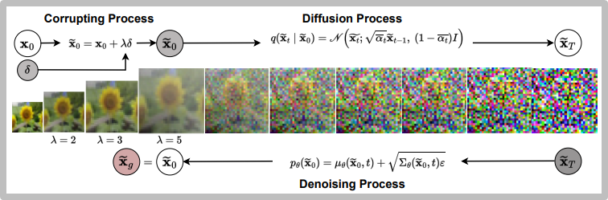
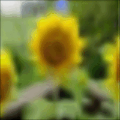
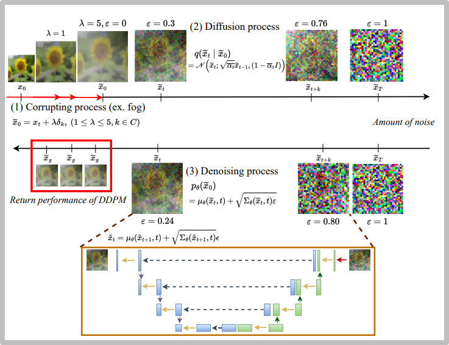
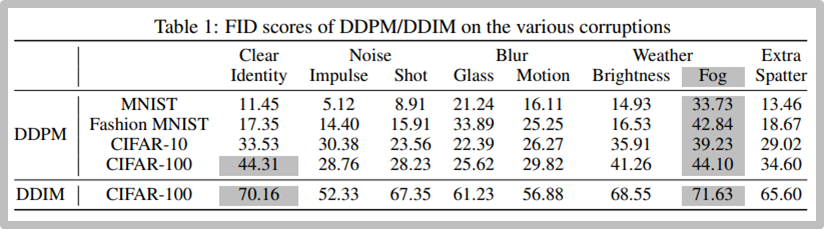
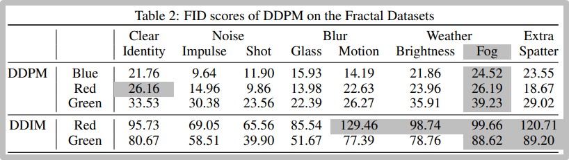

# Diffusion-C: Unveiling the Generative Challenges of Diffusion Models through Corrupted Data

> [**Diffusion-C: Unveiling the Generative Challenges of Diffusion Models through Corrupted Data**](https://arxiv.org/pdf/2312.08843)
>
> Keywoong Bae, Suan Lee, Wookey Lee
>
> *Conference on Neural Information Processing Systems (**NeurIPS**), Workshop on Diffusion Models, 2023*

​      

## Abstract

In our contemporary academic inquiry, we present "Diffusion-C," a foundational methodology to analyze the generative restrictions of Diffusion Models, particularly those akin to GANs, DDPM, and DDIM. By employing input visual data that has been subjected to a myriad of corruption modalities and intensities, we elucidate the performance characteristics of those Diffusion Models. The noise component takes center stage in our analysis, hypothesized to be a pivotal element influencing the mechanics of deep learning systems. In our rigorous expedition utilizing Diffusion-C, we have discerned the following critical observations: **(I)** Within the milieu of generative models under the Diffusion taxonomy, DDPM emerges as a paragon, consistently exhibiting superior performance metrics. **(II)** Within the vast spectrum of corruption frameworks, the fog and fractal corruptions notably undermine the functional robustness of both DDPM and DDIM. **(III)** The vulnerability of Diffusion Models to these particular corruptions is significantly influenced by topological and statistical similarities, particularly concerning the alignment between mean and variance. This scholarly work highlights Diffusion-C's core understandings regarding the impacts of various corruptions, setting the stage for future research endeavors in the realm of generative models.

## Overall mechanism

## Result

